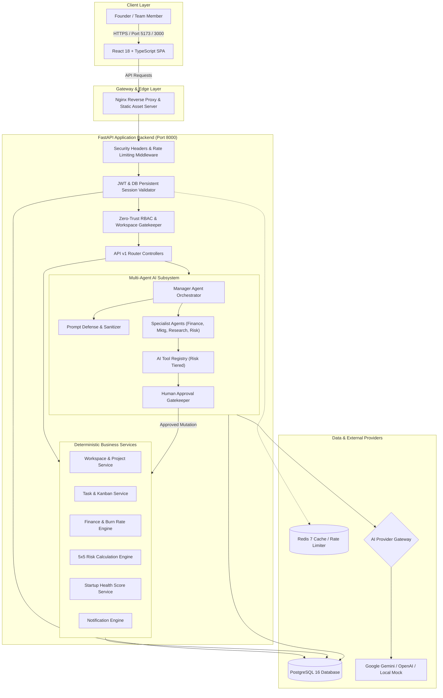
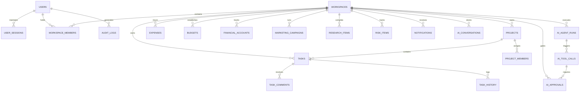

# StartupAI Manager — Technical & Architectural Documentation
### Production-Grade AI Startup Operating System

---

## 1. Project Information & Metadata

| Metadata Key | Value |
|---|---|
| **Project Name** | StartupAI Manager |
| **Version** | `1.0.0-production` |
| **Release Status** | Operational & Production-Ready |
| **Project Type** | Full-Stack Enterprise Web Application & Multi-Agent AI System |
| **Primary Domain** | Startup Operating System, Executive Intelligence, DevSecOps |
| **Technology Category** | Artificial Intelligence, Deterministic Business Logic, Secure Multi-Tenancy |
| **Repository Classification** | Open Source / Proprietary Enterprise Architecture |
| **Evaluated Test Pass Rate** | **100% (63 / 63 Automated Tests Passing)** |

---

## 2. Executive Summary

**StartupAI Manager** is an intelligent, production-ready operating system designed specifically for startup founders, venture executives, technical leads, and distributed project teams. Rather than implementing a superficial conversational chatbot, StartupAI Manager delivers a robust, multi-tenant software platform where specialized AI agents collaborate with human managers while critical mathematical computations (burn rates, runways, risk matrices, and task state transitions) remain strictly anchored to **deterministic backend logic**.

The system addresses the chronic problem of operational fragmentation in early-stage and growth-stage companies. Startup teams frequently disperse their critical context across separate spreadsheets, task trackers, financial dashboards, competitive memos, and fragmented messaging apps. StartupAI Manager consolidates these functions into an integrated platform powered by:
- Modern zero-trust Role-Based Access Control (RBAC).
- Persistent, database-backed session revocation in PostgreSQL.
- An autonomous multi-agent hierarchy orchestrated by a **Manager Agent**.
- Domain-specialized agents for Finance, Marketing, Market Research, and Risk Assessment.
- A human-in-the-loop approval gatekeeper for state-modifying actions.
- An Executive Command Center that calculates a mathematically weighted **Startup Health Score**.

---

## 3. Problem Statement

Startup companies operate under conditions of extreme uncertainty, rapid iteration, and strict resource constraints. Their management workflows routinely face critical friction points:

1. **Information & Operational Fragmentation**: Important business context is divided between separate platforms (accounting tools, issue trackers, marketing analytics, document stores), making cross-domain synthesis difficult.
2. **Hallucination Risk in Financial & Operational Reasoning**: Conventional LLM chat applications frequently hallucinate numbers, invent non-existent financial formulas, or estimate cash runways incorrectly when processing critical company data.
3. **Uncontrolled AI Actions**: Autonomous AI agents that modify production databases without human verification introduce catastrophic operational risks, such as unauthorized task deletions, budgetary misallocations, or data leaks.
4. **Weak Multi-Tenant Security in Fast-Paced Startups**: Simple startup software often suffers from Insecure Direct Object Reference (IDOR) vulnerabilities, credential theft, token reuse, or stored Cross-Site Scripting (XSS).
5. **Lack of Transparent Health Telemetry**: Founders lack a single, mathematically grounded index that synthesizes engineering delivery, cash runway safety, and active operational risks into actionable insight.

---

## 4. Proposed Solution

StartupAI Manager resolves these challenges through a layered, secure, and deterministic architecture:

- **Strict Separation of Concerns**: High-level intent comprehension and semantic extraction are delegated to the LLM agent layer, while mission-critical calculations (burn rate, runway, risk scoring, health scoring) are computed deterministically in Python backend services.
- **Human-in-the-Loop AI Governance**: Every tool registered with the AI subsystem is categorized into a risk tier (`LOW`, `MEDIUM`, `HIGH`). Read-only tools execute automatically; state-modifying actions (such as deleting projects or altering financial ledger items) are halted and staged as pending approvals requiring explicit human review.
- **Defensive Multi-Tenant Foundation**: Workspaces are isolated at the database level with strict foreign-key multi-tenancy. Unauthorized cross-tenant queries return `404 Not Found` rather than `403 Forbidden` to eliminate resource enumeration attacks.
- **Enterprise Authentication & Session Revocation**: Passwords are encrypted using Argon2id with OWASP-recommended parameters. JWT access tokens are paired with cryptographically random JTI identifiers persisted in a `UserSession` table in PostgreSQL, enabling immediate single-session and global-session revocation.

---

## 5. Objectives

### Primary Objectives
1. **Architect a Production-Ready Operating System**: Deliver a verified, deployable full-stack application supporting user authentication, workspace creation, project tracking, and Kanban task boards.
2. **Deploy an Autonomous Multi-Agent Hierarchy**: Create a Manager Agent that interprets founder directives and routes sub-tasks to specialized agents (Finance, Marketing, Research, Risk).
3. **Enforce Deterministic Computation**: Ensure all financial calculations, risk scoring formulas, and health metrics are calculated mathematically in Python rather than generated probabilistically by an LLM.
4. **Implement Human Approval Gateways**: Prevent unauthorized AI mutations through an auditable, role-verified approval workflow.
5. **Ensure OWASP-Compliant Security**: Validate system security through extensive unit, integration, and penetration testing covering XSS, IDOR, mass assignment, delimiter breakouts, and JWT manipulation.

### Secondary Objectives
1. Provide zero-cost offline local development through a `LocalMockProvider` while allowing seamless runtime configuration of Gemini or OpenAI LLMs.
2. Deliver a responsive, modern dark-slate UI built with React 18, TypeScript, and Tailwind CSS.
3. Build observable telemetry pipelines tracking execution latency, token counts, and tool failure rates.
4. Enable single-command containerized deployment via Docker and Docker Compose.

---

## 6. Key Features

### Foundation & Security
- **Argon2id Password Hashing**: Utilizes modern memory-hard password hashing parameters (`time_cost=3, memory_cost=64MB, parallelism=4`).
- **JWT & Persistent Session Revocation**: Access tokens (15–30 min expiration) and refresh tokens (7 days) tied to unique JTI records in PostgreSQL. Revocations take effect immediately across all cluster instances.
- **Role-Based Access Control (RBAC)**: Enforced server-side across 5 roles: `OWNER`, `ADMIN`, `MANAGER`, `TEAM_MEMBER`, and `VIEWER`.
- **Anti-Enumeration Tenant Isolation**: Workspace queries strictly verify membership and return `404 Not Found` upon unauthorized access.
- **OWASP Security Headers & Rate Limiting**: Built-in sliding-window rate limiter and headers including `X-Content-Type-Options: nosniff`, `X-Frame-Options: DENY`, and strict CSP.

### Core Startup Management
- **Workspaces & Memberships**: Multi-tenant workspace creation with role invitations and protection preventing sole owners from demoting themselves.
- **Projects & Milestone Tracking**: Project budgets, priorities, deadlines, and delivery statuses.
- **Interactive Kanban Board**: 4-column drag-and-drop workflow (`TODO`, `IN_PROGRESS`, `REVIEW`, `DONE`) with automated activity logging.
- **Task Collaboration & Immutable Audit**: HTML-sanitized task comments and an append-only `TaskHistory` ledger tracking who changed what field and when.

### Multi-Agent AI Core & Human-in-the-Loop
- **Manager Agent Orchestrator**: Parses high-level founder requests, builds structured execution plans, delegates sub-tasks to specialized agents, and executes tools.
- **Multi-Provider AI Abstraction**: Seamlessly supports `LocalMockProvider` (offline/free), `GeminiProvider`, and `OpenAIProvider`.
- **Prompt Defense Engine**: Neutralizes XML delimiter breakouts (`</USER_QUERY>`, `<SYSTEM_DIRECTIVE>`), redacts credentials, and defangs jailbreak attempts.
- **Risk-Tiered AI Tool Registry**: Granular tool permissions with automated human approval triggers for destructive mutations.
- **AI Telemetry & Observability**: Aggregates token consumption, estimated monetary spend, and execution latency across time windows (`24h`, `7d`, `30d`).

### Specialized Domain Intelligence
- **Finance Engine**: Deterministic trailing 30-day burn rate, cash runway estimation based on treasury balances, and budget vs actual variance tracking.
- **Multi-Currency System & INR (₹) Engine**: Built-in support for multiple currencies with Indian Rupee (INR / ₹) as the primary default, formatted via dynamic internationalization standards across accounts, budgets, and ledgers.
- **Marketing Engine**: Metrics aggregation across impressions, clicks, spend, and conversions to calculate CTR, CVR, and CAC.
- **Research Engine**: Competitive analysis and automated 4-quadrant SWOT matrix generation.
- **Risk Engine**: Deterministic $5 \times 5$ Likelihood $\times$ Impact risk matrix with automated heuristic scanners across tasks and finances.
- **Executive Command Center**: Composite **Startup Health Score** ($40\%$ Delivery, $35\%$ Runway, $25\%$ Risk) with transparent partial-data notices.
- **Executive Briefing & Strategic Audit Portal (`/reports`)**: Synthesizes live telemetry into a comprehensive, printable executive report with exportable PDF formatting, team RBAC governance tables, and academic evaluation sign-offs.
- **Dual Dark / Light Mode Theme Engine**: Context-driven theme switching supporting `light` and `dark` themes with persistent local storage, custom CSS variable tokens, and zero-flicker transitions.
- **In-App Notification Engine**: Persistent alerts with 24-hour event deduplication and unread counter badges.

---

## 7. System Architecture

StartupAI Manager is structured into distinct, decoupled architectural tiers:

```
[ Client Browser (React 18 SPA) ]
              │  HTTPS / WSS
              ▼
[ Nginx Reverse Proxy / Static Web Server ]
              │  Proxy Pass (/api/v1/)
              ▼
[ FastAPI Backend Application (Python 3.13) ]
  ├── Security & Rate Limiting Middleware
  ├── JWT & Persistent Session Validator (PostgreSQL UserSession)
  ├── RBAC Permission Gatekeeper
  ├── REST API Routing Controllers
  ├── Multi-Agent Orchestrator & Specialized Domain Agents
  ├── AI Tool Registry & Human Approval Engine
  └── Deterministic Business Logic Services
              │
      ┌───────┴───────────────┐
      ▼                       ▼
[ PostgreSQL 16 DB ]   [ External AI Gateways ]
  ├── Tenants & Auth     ├── Local Mock Provider
  ├── Core Management    ├── Google Gemini 1.5
  ├── AI Logs & Approvals└── OpenAI GPT-4o
  └── Telemetry & Alerts
```

### Key Architectural Characteristics
1. **Frontend**: Single Page Application (SPA) built using React 18, TypeScript, Tailwind CSS, TanStack React Query, and Lucide React.
2. **Backend**: Asynchronous, high-performance REST API built with FastAPI, Pydantic v2 (with `extra="forbid"` for mass-assignment defense), and SQLAlchemy 2.0.
3. **Database Layer**: PostgreSQL 16 in production with production-grade connection pooling (`pool_size=20, max_overflow=10, pool_recycle=1800, pool_pre_ping=True`). SQLite is supported in isolated testing environments.
4. **Caching & Acceleration**: Optional Redis 7 integration for distributed rate-limiting and shared session lookup caches.

---

## 8. System Architecture Diagram



---

## 9. Technology Stack

| Architecture Layer | Technology | Version | Purpose in StartupAI Manager |
|---|---|---|---|
| **Frontend Framework** | React | `18.3.1` | Declarative UI component architecture |
| **Language (Frontend)**| TypeScript | `5.5.3` | Static type safety and strict schema alignment |
| **Build Tooling** | Vite | `5.4.21` | Rapid HMR development and optimized production bundling |
| **Styling & Design** | Tailwind CSS | `3.4.1` | Responsive, dark-slate glassmorphic utility styling |
| **Icons & Visuals** | Lucide React | `0.344.0` | Crisp SVG iconography across navigation and alerts |
| **Server State Sync** | TanStack React Query| `5.28.4` | Asynchronous data fetching, caching, and cache invalidation |
| **Client Routing** | React Router DOM | `6.22.3` | Protected route guards and nested SPA layout routing |
| **Backend Framework** | FastAPI | `0.115.0+` | Asynchronous RESTful API framework with OpenAPI generation |
| **Language (Backend)** | Python | `3.13` | Enterprise backend execution runtime |
| **Validation Layer** | Pydantic v2 | `2.10.0+` | Request/response data validation with `extra="forbid"` |
| **ORM & Database** | SQLAlchemy | `2.0.38` | Modern transactional Object-Relational Mapping |
| **Database Migrations**| Alembic | `1.14.1` | Version-controlled, reproducible schema migrations |
| **Security & Hashing** | Argon2-cffi | `23.1.0` | OWASP-compliant memory-hard password hashing |
| **Token Authentication**| PyJWT | `2.10.1` | HMAC-SHA256 access and refresh token signing |
| **Relational Database** | PostgreSQL | `16-alpine` | ACID-compliant production database |
| **In-Memory Cache** | Redis | `7-alpine` | Optional session acceleration and distributed rate limiting |
| **Containerization** | Docker & Compose | Engine `24+`| Multi-stage non-root containerized deployment |
| **Testing Framework** | Pytest & AnyIO | `9.1.1` | Comprehensive unit, integration, and security test suite |

---

## 10. Project Directory Structure

```text
StartupAI-Manager/
├── .dockerignore                          # Build exclusions for Docker context
├── .env.example                           # Categorized environment variable template
├── .gitignore                             # Git ignore rules for virtualenvs, caches, secrets
├── BACKUP_AND_RECOVERY.md                 # Database backup, restore, and disaster recovery runbook
├── Dockerfile.backend                     # Hardened multi-stage non-root Python backend image
├── Dockerfile.frontend                    # Multi-stage Nginx Alpine frontend image
├── docker-compose.yml                     # 4-service production composition (DB, Redis, Backend, UI)
├── FINAL_PROJECT_REPORT.md                # High-level final project summary report
├── PHASE_7_AUDIT.md                       # Comprehensive architectural and gap analysis
├── PRODUCTION_READINESS.md                # Production readiness criteria verification checklist
├── README.md                              # Repository overview and quick-start instructions
├── SECURITY_AUDIT.md                      # Phase 6 security penetration findings and fixes
│
├── backend/                               # FastAPI Application Core
│   ├── alembic.ini                        # Alembic migration configuration
│   ├── requirements.txt                   # Production Python dependencies
│   ├── alembic/                           # Database migration history
│   │   ├── env.py                         # Migration runtime environment configuration
│   │   ├── script.py.mako                 # Migration template generator
│   │   └── versions/                      # Migration revision scripts (001 to 004)
│   ├── app/                               # Application package
│   │   ├── main.py                        # Application entry point, lifespan, & middleware
│   │   ├── agents/                        # Multi-agent AI implementation
│   │   │   ├── orchestrator.py            # Manager Agent orchestration and workflow engine
│   │   │   ├── prompt_defense.py          # XML delimiter defanging and prompt defense
│   │   │   ├── provider.py                # Multi-provider abstraction (Gemini, OpenAI, Mock)
│   │   │   ├── finance_agent.py           # Specialist Finance Agent
│   │   │   ├── marketing_agent.py         # Specialist Marketing Agent
│   │   │   ├── research_agent.py          # Specialist Market Research Agent
│   │   │   ├── risk_agent.py              # Specialist Risk Detection Agent
│   │   │   ├── report_agent.py            # Specialist Reporting Agent
│   │   │   └── task_agent.py              # Specialist Task Agent
│   │   ├── api/                           # API routing layer
│   │   │   ├── deps.py                    # Dependency injection (Auth, DB, Current User)
│   │   │   └── v1/                        # Version 1 API routers
│   │   │       ├── router.py              # Master API router aggregation
│   │   │       ├── auth.py                # Register, login, refresh, logout endpoints
│   │   │       ├── workspaces.py          # Workspace CRUD and member management
│   │   │       ├── projects.py            # Project management endpoints
│   │   │       ├── tasks.py               # Kanban tasks, comments, and history
│   │   │       ├── ai.py                  # AI chat, tool runs, and human approvals
│   │   │       ├── finance.py             # Treasury accounts, expenses, runway endpoints
│   │   │       ├── marketing.py           # Campaign tracking and metrics endpoints
│   │   │       ├── research.py            # Market intelligence and SWOT endpoints
│   │   │       ├── risks.py               # 5x5 Risk scoring and risk scanner endpoints
│   │   │       ├── dashboard.py           # Executive dashboard summary endpoint
│   │   │       └── notifications.py       # In-app notifications and unread badge endpoints
│   │   ├── core/                          # Cross-cutting foundational modules
│   │   │   ├── config.py                  # Pydantic Settings and environment validation
│   │   │   ├── permissions.py             # RBAC role definitions and permission matrix
│   │   │   ├── security.py                # Argon2id hashing and JWT token management
│   │   │   └── middleware.py              # Security headers, correlation IDs, rate limiting
│   │   ├── database/                      # Database engine and session lifecycle
│   │   │   ├── base.py                    # Declarative Base metadata registry
│   │   │   └── session.py                 # Engine initialization and connection pooling
│   │   ├── models/                        # SQLAlchemy database entity models
│   │   │   ├── user.py                    # User identity model
│   │   │   ├── session.py                 # Persistent UserSession model
│   │   │   ├── workspace.py               # Workspace and WorkspaceMember models
│   │   │   ├── project.py                 # Project and ProjectMember models
│   │   │   ├── task.py                    # Task, TaskComment, and TaskHistory models
│   │   │   ├── ai.py                      # AIAgentRun, AIToolCall, AIApproval, AIConversation
│   │   │   ├── finance.py                 # Expense, Budget, and FinancialAccount models
│   │   │   ├── marketing.py               # MarketingCampaign model
│   │   │   ├── research.py                # ResearchItem model
│   │   │   ├── risk.py                    # RiskItem model
│   │   │   ├── notification.py            # Notification model
│   │   │   └── audit.py                   # AuditLog model
│   │   ├── schemas/                       # Pydantic validation schemas
│   │   ├── services/                      # Deterministic domain business logic
│   │   └── tools/                         # AI tool implementations and registration
│   │       └── registry.py                # Tool registry, risk classification, & executors
│   └── tests/                             # Comprehensive automated test suite
│       ├── conftest.py                    # Fixtures and test database configuration
│       ├── unit/                          # Isolated unit tests (Auth, Math, Risk, Prompts)
│       ├── integration/                   # Workflow and domain integration tests
│       └── security/                      # Security penetration and IDOR verification tests
│
└── frontend/                              # React 18 SPA Application
    ├── index.html                         # SPA entry HTML
    ├── package.json                       # Node dependencies and scripts
    ├── tsconfig.json                      # Strict TypeScript compiler options
    ├── vite.config.ts                     # Vite build and proxy settings
    ├── nginx.conf                         # Hardened Nginx production configuration
    └── src/                               # Application source code
        ├── App.tsx                        # Master route configuration and providers
        ├── main.tsx                       # React DOM entry point
        ├── api/                           # API clients (Client, Auth, Workspaces, AI, etc.)
        ├── components/                    # Reusable React components
        │   ├── common/                    # Button, Input, Card, Badge, EmptyWorkspaceState
        │   └── layout/                    # Navbar, Sidebar, AppLayout, NotificationBell, Modals
        ├── context/                       # React Context providers (AuthContext, WorkspaceContext)
        ├── pages/                         # Route page views (Dashboard, Tasks, Finance, etc.)
        └── types/                         # TypeScript interfaces and shared types
```

---

## 11. Frontend Architecture

The frontend is structured as a resilient, single-page application built on React 18, utilizing functional components and hooks:

- **State Management & React Query**: The application utilizes `@tanstack/react-query` for asynchronous server state synchronization and client context (`AuthContext`, `WorkspaceContext`) for session and active tenant persistence.
- **Routing & Route Protection (`AppLayout.tsx`)**:
  - Unauthenticated routes (`/login`, `/register`) redirect authenticated users directly to `/dashboard`.
  - Protected routes are wrapped in an `AppLayout` component that checks token validity. If authentication checks fail, the user is redirected to `/login`.
- **Top Navigation Bar (`Navbar.tsx`)**: Displays the active workspace selector, notification bell with real-time unread badges, user profile metadata, and logout button.
- **Sidebar Navigation (`Sidebar.tsx`)**: Categorizes startup operations into Management (`Executive Health`, `AI Manager`, `AI Monitoring`, `Notifications`), Operations (`Projects`, `Tasks & Kanban`, `Finance & Burn`, `Marketing`, `Research`, `Risks`), and Administration (`Team`, `Settings & Audit`).
- **Foreground Centered Modals**: The workspace and project creation modals (`CreateWorkspaceModal.tsx`) are mounted at the root DOM level with `z-[100]` and responsive scrollable containers (`overflow-y-auto`), ensuring cards remain perfectly centered and never clipped on low-resolution displays.
- **Interactive Kanban Board (`KanbanPage.tsx`)**: Renders a 4-column board with status transitions, task creation, assignment tagging, and a slide-over details drawer showing comment history and immutable audit entries.

---

## 12. Backend Architecture

The backend application is designed following clean architectural principles:

```
[ HTTP Request ]
       │
       ▼
[ Middleware Pipeline ] ──> Security Headers, Correlation ID, Sliding-Window Rate Limiting
       │
       ▼
[ Router Layer (app/api/v1/) ] ──> Route definitions, HTTP verbs, and query/path params
       │
       ▼
[ Dependency Injection (app/api/deps.py) ] ──> DB Session Local, Bearer JWT Auth, Current User
       │
       ▼
[ Service Layer (app/services/) ] ──> Transactional business logic, deterministic calculations
       │
       ▼
[ Database Layer (SQLAlchemy 2.0 ORM) ] ──> Models, Queries, Connection Pool, and Migrations
```

### Key Architectural Safeguards
1. **Correlation IDs**: Each incoming HTTP request is assigned a unique `X-Correlation-ID` header (or preserves the client-provided header), which is injected into all logging outputs and database audit entries.
2. **Standardized Response Envelopes**: All successful responses return a uniform envelope:
   ```json
   {
     "success": true,
     "message": "Operation completed successfully.",
     "data": { ... }
   }
   ```
3. **Structured Exception Handling**: Handlers catch `HTTPException`, Pydantic `RequestValidationError`, and unexpected exceptions, returning safe error envelopes without exposing internal stack traces:
   ```json
   {
     "success": false,
     "error": {
       "code": "BAD_REQUEST",
       "message": "Descriptive safe error message",
       "details": []
     }
   }
   ```

---

## 13. Database Architecture & ER Diagram

The database schema comprises **22 relational tables** managed through Alembic migrations.

### Core Entity Relationships



### Key Database Models Summary

| Model Name | Table Name | Key Fields | Purpose & Security Design |
|---|---|---|---|
| `User` | `users` | `id`, `email`, `hashed_password`, `full_name`, `is_active` | System user identities; passwords stored as Argon2id hashes. |
| `UserSession` | `user_sessions` | `id`, `user_id`, `token_jti`, `refresh_token_hash`, `is_revoked` | Persistent session tracking; enables cluster-wide instant token revocation. |
| `Workspace` | `workspaces` | `id`, `name`, `slug`, `industry`, `currency`, `created_by` | Top-level tenant isolation boundary for all enterprise data. |
| `WorkspaceMember` | `workspace_members`| `id`, `workspace_id`, `user_id`, `role` | Maps users to workspaces with RBAC roles (`OWNER` through `VIEWER`). |
| `Project` | `projects` | `id`, `workspace_id`, `name`, `status`, `priority`, `budget` | High-level initiatives and milestones. |
| `Task` | `tasks` | `id`, `workspace_id`, `project_id`, `title`, `status`, `assignee_id`| Work units on the Kanban board (`TODO`, `IN_PROGRESS`, `REVIEW`, `DONE`). |
| `TaskComment` | `task_comments` | `id`, `task_id`, `user_id`, `content` | Collaboration comments; content is sanitized with `html.escape`. |
| `TaskHistory` | `task_history` | `id`, `task_id`, `user_id`, `action`, `field_changed` | Immutable append-only audit trail for all task modifications. |
| `Expense` | `expenses` | `id`, `workspace_id`, `amount`, `category`, `expense_date` | Financial ledger records used to calculate deterministic 30-day burn rate. |
| `FinancialAccount`| `financial_accounts`| `id`, `workspace_id`, `current_cash_balance`, `currency` | Treasury account balance used to compute cash runway. |
| `RiskItem` | `risk_items` | `id`, `workspace_id`, `title`, `likelihood`, `impact`, `risk_score`| Tracked risks scored deterministically via Likelihood $\times$ Impact ($1–25$). |
| `Notification` | `notifications` | `id`, `workspace_id`, `user_id`, `event_key`, `is_read` | In-app alerts with 24-hour deduplication keys. |
| `AIApproval` | `ai_approvals` | `id`, `workspace_id`, `tool_name`, `parameters`, `status` | Human-in-the-loop approval gate for medium and high risk AI tool executions. |
| `AuditLog` | `audit_logs` | `id`, `workspace_id`, `user_id`, `action`, `resource_type` | Permanent audit records of security and administrative operations. |

---

## 14. Authentication & Session Management

StartupAI Manager implements a zero-trust, persistent session security architecture:

```
1. Client submits credentials (Email + Password)
   │
   ▼
2. Argon2id Verification (time_cost=3, memory_cost=64MB, parallelism=4)
   │
   ▼
3. Unique Token JTI generated via secrets.token_urlsafe(32)
   │
   ▼
4. Persistent UserSession record created in PostgreSQL:
   - token_jti: Unique session identifier
   - refresh_token_hash: SHA-256 hash of refresh token
   - is_revoked: False
   - ip_address, user_agent, expires_at
   │
   ▼
5. Tokens Issued to Client:
   - Access Token: 15-30 min lifetime (signed JWT containing sub=user_id, jti=session_jti)
   - Refresh Token: 7-day lifetime (cryptographic random secret)
```

### Session Revocation & Rotation Flows
- **Every Authenticated Request**: The backend extracts the `jti` claim from the JWT access token and queries the `UserSession` table in PostgreSQL. If `session.is_revoked == True` or the session does not exist, the request is immediately rejected with HTTP 401 (`SESSION_REVOKED`).
- **Token Refresh & Rotation**: When `/auth/refresh` is called, the old session is immediately marked revoked (`is_revoked = True`), a fresh JTI and new session are created in PostgreSQL, and new access/refresh tokens are returned. If an already-revoked refresh token is reused, it triggers an instant reuse detection alarm.
- **Logout & Logout-All**:
  - `POST /auth/logout`: Revokes the current session JTI in PostgreSQL.
  - `POST /auth/logout-all`: Sets `is_revoked = True` for all active sessions belonging to the user.
- **Password Change Revocation**: When a user changes their password, all active sessions across all devices are automatically revoked in the database.

---

## 15. Role-Based Access Control (RBAC)

The system defines 5 hierarchical roles with granular server-side permissions:

| Operation / Feature Area | OWNER | ADMIN | MANAGER | TEAM_MEMBER | VIEWER |
|---|:---:|:---:|:---:|:---:|:---:|
| **Delete Workspace** | ✓ | ✗ | ✗ | ✗ | ✗ |
| **Manage Workspace Members & Roles** | ✓ | ✓ | ✗ | ✗ | ✗ |
| **Update Workspace Settings** | ✓ | ✓ | ✗ | ✗ | ✗ |
| **Create Projects** | ✓ | ✓ | ✓ | ✗ | ✗ |
| **Delete Projects** | ✓ | ✓ | ✗ | ✗ | ✗ |
| **Create & Update Tasks** | ✓ | ✓ | ✓ | ✓ | ✗ |
| **Transition Kanban Status** | ✓ | ✓ | ✓ | ✓ | ✗ |
| **Add Task Comments** | ✓ | ✓ | ✓ | ✓ | ✗ |
| **Delete Tasks** | ✓ | ✓ | ✓ | ✗ | ✗ |
| **Record Expenses & Set Budgets** | ✓ | ✓ | ✓ | ✗ | ✗ |
| **Update Treasury Cash Balance** | ✓ | ✓ | ✗ | ✗ | ✗ |
| **Create Marketing Campaigns** | ✓ | ✓ | ✓ | ✓ | ✗ |
| **Create Research Items** | ✓ | ✓ | ✓ | ✓ | ✗ |
| **Create & Manage Risks** | ✓ | ✓ | ✓ | ✓ | ✗ |
| **Approve / Reject AI Actions** | ✓ | ✓ | ✓ | ✗ | ✗ |
| **Interact with AI Manager Agent** | ✓ | ✓ | ✓ | ✓ | ✗ |
| **View Dashboard & Read Telemetry** | ✓ | ✓ | ✓ | ✓ | ✓ |

> **Sole Owner Protection**: The system enforces a strict constraint preventing the sole `OWNER` of a workspace from demoting themselves or leaving the workspace until ownership is transferred to another member.

---

## 16. Multi-Tenancy & Data Isolation

Multi-tenancy in StartupAI Manager is implemented using a **discriminator column pattern** (`workspace_id`) enforced across all database tables:

1. **Anti-Enumeration 404 Responses**: When a user requests a project, task, expense, or risk belonging to another workspace, the API returns `404 Not Found` rather than `403 Forbidden`. This prevents attackers from enumerating valid IDs across tenants.
2. **Cross-Tenant Assignment Defense**: When assigning users to tasks or projects, the service layer queries `workspace_members` to verify that the target user is an active member of that specific workspace. Assigning external users is strictly rejected.
3. **Database-Level Foreign Keys**: Every resource table maintains an indexed foreign key referencing `workspaces.id` with `ON DELETE CASCADE` constraints.

---

## 17. AI Architecture & Orchestration

The AI subsystem operates as an intelligent operating layer that interacts with the backend strictly through authenticated, validated tools:

```
[ User Query ]
       │
       ▼
[ Prompt Defense Engine ] ──> Defang XML tags, filter jailbreaks, redact sensitive secrets
       │
       ▼
[ Manager Agent Orchestrator ] ──> Decompose query into sub-tasks & select specialized agent
       │
       ▼
[ Specialized Agent Execution ] (Finance, Marketing, Research, Risk)
       │
       ▼
[ AI Tool Registry Lookup ] ──> Validate JSON schema & check RBAC permissions
       │
       ▼
[ Risk Gatekeeper Check ]
   ├── LOW Risk ───────────────> Execute tool immediately via backend service
   └── MEDIUM / HIGH Risk ─────> Stage as AIApproval; notify workspace managers
                                       │
                                [ Human Approves ]
                                       │
                                       ▼
                                Controlled Service Mutation & Audit Logging
```

---

## 18. Manager Agent

The **Manager Agent** (`orchestrator.py`) acts as the central coordinator of the AI subsystem:

- **Planning & Decomposition**: When a user submits an instruction (e.g., *"Assess our financial runway, list critical risks, and draft a high-priority task"*), the Manager Agent analyzes the intent, builds an execution plan, and invokes the appropriate specialist agents in sequence.
- **Synthesizing Responses**: The Manager Agent collects the structured results from specialist agents, formats them into a cohesive markdown response, and returns actionable recommendations to the user.
- **Zero Direct Database Access**: The Manager Agent cannot write directly to the database via raw SQL. It interacts with the platform exclusively through verified functions in the **AI Tool Registry**.

---

## 19. Specialized AI Agents

### 1. Finance Agent (`finance_agent.py`)
- Analyzes trailing 30-day operating expenditures.
- Retrieves current cash balances from treasury accounts.
- Evaluates category budget variance (e.g., identifying over-budget categories).
- Provides contextual explanations of financial burn and cash runway.

### 2. Marketing Agent (`marketing_agent.py`)
- Synthesizes marketing campaign performance across multiple channels.
- Calculates blended performance metrics: Click-Through Rate (CTR), Conversion Rate (CVR), and Customer Acquisition Cost (CAC).
- Generates campaign optimization recommendations.

### 3. Research Agent (`research_agent.py`)
- Manages competitive intelligence and market trend items.
- Synthesizes research into a structured **4-Quadrant SWOT Matrix** (Strengths, Weaknesses, Opportunities, Threats).
- Implements strict input sanitization on untrusted external research text to prevent indirect prompt injection.

### 4. Risk Agent (`risk_agent.py`)
- Computes deterministic risk scores using the $5 \times 5$ matrix.
- Runs heuristic risk scanners across open tasks (e.g., overdue tasks) and budget overruns.
- Formulates mitigation plans and triggers automated risk alert notifications.

---

## 20. AI Tool Registry

The **Tool Registry** (`registry.py`) defines every action the AI agents can perform. Each tool specifies:
1. **Pydantic Schema**: Enforces strict argument typing and forbids extra parameters.
2. **Required Permission**: Maps to the user's RBAC permissions (e.g., `Permission.TASK_CREATE`).
3. **Risk Classification**:
   - `LOW`: Read-only queries (e.g., `list_projects`, `get_cash_runway`, `get_dashboard_summary`). Executed immediately.
   - `MEDIUM`: Reversible or standard mutations (e.g., `create_task`, `create_marketing_campaign`).
   - `HIGH`: Irreversible or high-impact mutations (e.g., `delete_project`, `record_expense`, `update_cash_balance`).

> **Sandbox Guarantee**: AI agents are never given shell execution, raw SQL execution, filesystem write access, or unrestricted network socket access.

---

## 21. Human Approval System

When a tool classified as `MEDIUM` or `HIGH` risk is requested by an agent:

1. **Staging**: The execution is paused. A record is created in the `ai_approvals` table with status `PENDING`, capturing the tool name, JSON arguments, and rationale.
2. **Notification**: An automated in-app notification is dispatched to workspace owners and managers.
3. **Human Review**: A manager views the pending approval card on the Executive Dashboard or Approvals drawer.
4. **Resolution**:
   - **Approve**: The tool executor runs the underlying service function using the approving user's authorization context and logs an immutable audit event.
   - **Reject**: The approval is marked `REJECTED` with an optional rejection reason, and no database mutation occurs.

---

## 22. Finance Module

The Finance module provides mathematical, auditable tracking of company funds:

- **Trailing 30-Day Burn Rate**:
  $$\text{Burn Rate} = \sum \text{Expenses in last 30 days}$$
  *(If no expenses occurred in the last 30 days, it falls back to the historical monthly average).*
- **Deterministic Cash Runway**:
  $$\text{Runway (Months)} = \frac{\text{Available Cash Balance}}{\text{Monthly Burn Rate}}$$
- **Budget vs. Actual Variance**: Evaluates current category spend against defined monthly/quarterly budgets and flags over-budget categories.
- **Transparent Missing Data Handling**: If no cash balance has been provided, the system does not guess or hallucinate a runway; it explicitly returns `runway_months: null` with a notice: *"Available cash balance has not been provided."*

---

## 23. Marketing Module

The Marketing module tracks and evaluates acquisition channels:

- **Campaign Fields**: Name, channel (`SOCIAL_MEDIA`, `SEARCH_ENGINE`, `EMAIL`, `CONTENT`, `EVENTS`), budget, actual spend, impressions, clicks, conversions, start/end dates, and status (`DRAFT`, `ACTIVE`, `PAUSED`, `COMPLETED`).
- **Computed Metrics**:
  $$\text{CTR} = \frac{\text{Clicks}}{\text{Impressions}} \times 100\%$$
  $$\text{CVR} = \frac{\text{Conversions}}{\text{Clicks}} \times 100\%$$
  $$\text{CAC} = \frac{\text{Actual Spend}}{\text{Conversions}}$$

---

## 24. Research Module

The Research module enables teams to store and synthesize market intelligence:

- **Research Categorization**: Items are organized by topic (`COMPETITOR_ANALYSIS`, `INDUSTRY_TRENDS`, `CUSTOMER_FEEDBACK`, `REGULATORY`).
- **SWOT Matrix Generation**: Synthesizes stored intelligence items into a 4-quadrant SWOT matrix (Strengths, Weaknesses, Opportunities, Threats).
- **Indirect Prompt Injection Defense**: Untrusted external data is passed through `sanitize_for_prompt()` to ensure malicious third-party content cannot hijack agent directives.

---

## 25. Risk Management Module

The Risk module manages operational, financial, technical, and compliance risks:

- **Deterministic $5 \times 5$ Scoring Formula**:
  $$\text{Risk Score} = \text{Likelihood } (1–5) \times \text{Impact } (1–5)$$
- **Severity Tiers**:
  - `CRITICAL`: Risk Score $\ge 20$
  - `HIGH`: Risk Score $\ge 12$
  - `MEDIUM`: Risk Score $\ge 6$
  - `LOW`: Risk Score $< 6$
- **Automated Risk Scanners**: Periodically scans task deadlines (flagging overdue items) and financial records (flagging budget overruns) to create proactive risk alerts.

---

## 26. Executive Dashboard & Health Score

The **Executive Command Center** synthesizes data from all business domains into a single cockpit:

### The Deterministic Startup Health Score
The Health Score is computed mathematically (range $0–100$):

$$\text{Health Score} = (0.40 \times \text{Delivery}) + (0.35 \times \text{Runway}) + (0.25 \times \text{Risk})$$

- **Delivery Health ($40\%$)**: Percentage of tasks completed, penalized by $10$ points for each overdue task.
- **Runway Safety ($35\%$)**:
  - Runway $\ge 12\text{ months}$: $100$ points (`EXCELLENT`)
  - Runway $6–12\text{ months}$: $80–100$ points (`HEALTHY`)
  - Runway $3–6\text{ months}$: $50–80$ points (`CAUTION`)
  - Runway $< 3\text{ months}$: $0–50$ points (`CRITICAL`)
- **Risk Index ($25\%$)**: Starts at $100$ points, with deductions for critical ($-25$), high ($-15$), and medium ($-5$) active risks.
- **Partial Data Resilience**: If cash data is unavailable, the system redistributes the weights ($60\%$ Delivery, $40\%$ Risk) and flags the confidence level as `PARTIAL_DATA`.

---

## 27. Telemetry & Monitoring

The Telemetry subsystem provides operational observability into AI agent executions:

- **Logged Metrics**: Total token usage, blended LLM cost, average execution latency, minimum/maximum latency, and tool failure rates.
- **Time Window Aggregations**: Supports time-series aggregations across `24h`, `7d`, and `30d`.
- **Privacy Protections**: Prompts and tool payloads are stripped of credentials, session tokens, and passwords before telemetry records are committed.

---

## 28. Notification System

The in-app notification engine delivers timely alerts across the platform:

- **Triggers**: Pending AI approvals, critical risk detections, budget overruns, and task assignments.
- **Deduplication Engine**: Generates deterministic `event_key` hashes (e.g., `approval_pending:{approval_id}`) ensuring identical alerts are not duplicated within a 24-hour window.
- **UI Integration**: Displays unread counter badges on the navigation bar bell icon, dropdown alert previews, and a dedicated inbox view (`/notifications`).

---

## 29. Audit Logging

Every security-sensitive or administrative action creates an immutable `AuditLog` record containing:
- Timestamp (UTC)
- Workspace ID & User ID
- Client IP address and User-Agent
- Correlation ID (`X-Correlation-ID`)
- Action identifier (e.g., `USER_LOGIN`, `PASSWORD_CHANGE`, `TASK_DELETE`, `AI_TOOL_EXECUTE`)
- Resource type and resource ID

---

## 30. Security Architecture

StartupAI Manager embeds multi-layered defense-in-depth across the entire stack:

```
                     SECURITY IN DEPTH
                     
[ Edge / Network ]  ──> Non-root containers, no exposed internal ports
[ Transport ]       ──> Strict TLS 1.3, HTTPS-only cookies
[ Web Layer ]       ──> OWASP Security Headers (nosniff, DENY, CSP), Rate Limiting
[ Authentication ]  ──> Argon2id hashing, JWT access tokens, persistent DB session store
[ Authorization ]   ──> Zero-trust RBAC matrix, anti-enumeration 404 responses
[ Input Validation ]──> Pydantic v2 extra="forbid", uniform HTML escaping
[ AI Safety ]       ──> Delimiter defanging, secret scrubbing, human approval gates
[ Database ]        ──> Parameterized SQL via SQLAlchemy ORM, connection pool pre-ping
```

---

## 31. Security Audit Results (Phase 6 & 7)

During Phase 6 security hardening and penetration testing, 5 potential vulnerabilities were identified, reproduced, remediated, and verified:

| Vulnerability ID | Vulnerability Class | Severity | Remediated Status | Verification Test |
|---|---|---|:---:|---|
| **SEC-001** | Prompt Injection Delimiter Breakout | **HIGH** | **RESOLVED** | `test_prompt_injection_delimiter_breakout_defense` |
| **SEC-002** | Stored Cross-Site Scripting (XSS) | **MEDIUM** | **RESOLVED** | `test_stored_xss_sanitization_across_entities` |
| **SEC-003** | Mass Assignment / Parameter Pollution | **MEDIUM** | **RESOLVED** | `test_mass_assignment_forbid_extra_fields` |
| **SEC-004** | Weak Production `SECRET_KEY` Entropy | **MEDIUM** | **RESOLVED** | `test_production_secret_key_guard` |
| **SEC-005** | Rate Limiting Burst Threshold Testing | **LOW** | **RESOLVED** | `test_rate_limiting_enforcement` |
| **SEC-006** | Non-Root Container Execution | **INFO** | **COMPLIANT** | Multi-stage Docker verification |

### Summary Metrics
- **Critical Vulnerabilities**: **0**
- **High Vulnerabilities**: **0 (1 identified, 1 fixed)**
- **Medium Vulnerabilities**: **0 (3 identified, 3 fixed)**
- **Low Vulnerabilities**: **0 (1 identified, 1 fixed)**
- **Total Unresolved Vulnerabilities**: **0 (Zero)**

---

## 32. API Endpoint Reference

All endpoints are prefixed with `/api/v1` (except root health probes).

### Health & System Probes
- `GET /health` — Liveness probe returning operational status and version.
- `GET /ready` — Readiness probe testing active PostgreSQL connection pool connectivity.

### Authentication (`/auth`)
- `POST /auth/register` — Create a new user account.
- `POST /auth/login` — Authenticate and obtain access + refresh tokens.
- `POST /auth/refresh` — Rotate refresh token and obtain new access token.
- `POST /auth/logout` — Revoke current session JTI in PostgreSQL.
- `POST /auth/logout-all` — Revoke all active sessions belonging to user.
- `GET /auth/me` — Retrieve current authenticated user profile.
- `POST /auth/change-password` — Change password and revoke all existing sessions.
- `GET /auth/sessions` — List active sessions and revocation statuses.

### Workspaces (`/workspaces`)
- `GET /workspaces` — List workspaces where current user is a member.
- `POST /workspaces` — Create a new isolated workspace.
- `GET /workspaces/{id}` — Get workspace details.
- `PATCH /workspaces/{id}` — Update workspace metadata.
- `GET /workspaces/{id}/members` — List workspace members.
- `POST /workspaces/{id}/members` — Invite user with an assigned RBAC role.
- `PATCH /workspaces/{id}/members/{member_id}` — Update member role.
- `DELETE /workspaces/{id}/members/{member_id}` — Remove member from workspace.

### Projects (`/workspaces/{id}/projects`)
- `GET /` — List projects with status and search filters.
- `POST /` — Create a new project.
- `GET /{project_id}` — Retrieve project details.
- `PATCH /{project_id}` — Update project budget, status, or deadline.
- `DELETE /{project_id}` — Delete project and associated tasks.

### Tasks (`/workspaces/{id}/tasks`)
- `GET /` — List tasks with status and project filters.
- `POST /` — Create a new task.
- `GET /{task_id}` — Retrieve task details.
- `PATCH /{task_id}` — Update task title, description, priority, or assignee.
- `PATCH /{task_id}/status` — Transition Kanban status (`TODO`, `IN_PROGRESS`, `REVIEW`, `DONE`).
- `DELETE /{task_id}` — Delete task.
- `GET /{task_id}/comments` — List task comments.
- `POST /{task_id}/comments` — Post XSS-sanitized comment.
- `GET /{task_id}/history` — Retrieve immutable task audit history.

### AI & Approvals (`/workspaces/{id}/ai`)
- `POST /chat` — Send message to Manager Agent orchestrator.
- `GET /approvals` — List pending human approvals.
- `POST /approvals/{approval_id}/approve` — Approve staged AI action.
- `POST /approvals/{approval_id}/reject` — Reject staged AI action with reason.
- `GET /telemetry` — Retrieve aggregated latency, token, and cost metrics.

### Finance (`/workspaces/{id}/finance`)
- `GET /expenses` — List operating expenses.
- `POST /expenses` — Record operating expense.
- `GET /budgets` — List category budgets.
- `POST /budgets` — Set category budget limit.
- `GET /account` — Retrieve current treasury account balance.
- `POST /account` — Update cash balance.
- `GET /burn-rate` — Retrieve trailing 30-day burn rate.
- `GET /runway` — Retrieve cash runway calculation.

### Marketing (`/workspaces/{id}/marketing`)
- `GET /campaigns` — List marketing campaigns.
- `POST /campaigns` — Create marketing campaign.
- `GET /performance` — Retrieve aggregated CTR, CVR, and CAC metrics.

### Research (`/workspaces/{id}/research`)
- `GET /items` — List research items.
- `POST /items` — Create research intelligence item.
- `GET /swot` — Retrieve generated 4-quadrant SWOT matrix.

### Risks (`/workspaces/{id}/risks`)
- `GET /` — List risk items.
- `POST /` — Create risk item with deterministic $5 \times 5$ scoring.
- `POST /scan` — Execute automated cross-domain risk scanner.

### Dashboard & Notifications (`/workspaces/{id}`)
- `GET /dashboard/summary` — Retrieve executive command center payload.
- `GET /notifications` — List notifications.
- `GET /notifications/unread-count` — Retrieve unread notification badge count.
- `PATCH /notifications/{notification_id}/read` — Mark notification as read.
- `POST /notifications/read-all` — Mark all notifications as read.

---

## 33. Installation & Setup Guide

### Prerequisites
- **Python**: Version `3.13` (Python `3.11+` supported)
- **Node.js**: Version `18+` or `20+` (LTS recommended)
- **Git**: Version `2.30+`
- **Docker & Docker Compose** *(optional for containerized deployment)*

### Step 1: Clone Repository
```bash
git clone https://github.com/kdhinadayalan/StartupAI-Manager.git
cd StartupAI-Manager
```

### Step 2: Backend Setup
```bash
cd backend
python -m venv venv

# Windows:
venv\Scripts\activate
# Linux/macOS:
source venv/bin/activate

pip install -r requirements.txt
python -m alembic upgrade head
```

### Step 3: Frontend Setup
```bash
cd ../frontend
npm install
```

---

## 34. Environment Variables Configuration

Create a `.env` file in the project root based on `.env.example`:

| Environment Variable | Required in Prod | Default Value | Purpose |
|---|:---:|---|---|
| `PROJECT_NAME` | No | `"StartupAI Manager"` | Platform name displayed in metadata |
| `ENVIRONMENT` | **Yes** | `"development"` | Set to `"production"` in live deployment |
| `DEBUG` | **Yes** | `True` | Set to `False` in production |
| `SECRET_KEY` | **Yes** | Placeholder | $\ge 32$-character random key (`openssl rand -hex 32`) |
| `DATABASE_URL` | **Yes** | `sqlite:///./startup_ai.db` | PostgreSQL connection string in production |
| `REDIS_URL` | No | `""` | Optional Redis cache / session accelerator |
| `AI_PROVIDER_DEFAULT` | No | `"mock"` | `"mock"` (offline), `"gemini"`, or `"openai"` |
| `GEMINI_API_KEY` | If Gemini | `""` | Google Gemini API key |
| `OPENAI_API_KEY` | If OpenAI | `""` | OpenAI API key |
| `RATE_LIMIT_PER_MINUTE` | No | `100` | Maximum requests per IP per minute |
| `BACKEND_CORS_ORIGINS` | **Yes** | `["http://localhost:5173"]` | Allowed web origins |

---

## 35. Running the Application

### Local Development Mode
```powershell
# Terminal 1 (Backend):
cd "e:\StartupAI Manager\backend"
python -m uvicorn app.main:app --reload --port 8000

# Terminal 2 (Frontend):
cd "e:\StartupAI Manager\frontend"
npm run dev
```
- Access Frontend: `http://localhost:5173`
- Access Backend API Docs: `http://localhost:8000/docs`

### Docker Compose Mode
```bash
# Build and run containers in background
docker compose build
docker compose up -d

# Check operational logs
docker compose logs -f
```
- Access Frontend: `http://localhost:3000`
- Access Backend API: `http://localhost:8000`

---

## 36. Health & Readiness Probes

The application provides two specialized probes for load balancers and orchestrators:

- **Liveness Probe (`GET /health`)**: Returns HTTP 200 indicating the web server process is responsive.
- **Readiness Probe (`GET /ready`)**: Executes a `SELECT 1` query against the database connection pool. Returns HTTP 200 when ready to accept user traffic, or HTTP 503 if the database is unreachable. Internal topology, passwords, and stack traces are strictly hidden.

---

## 37. Database Migrations Guide

Alembic manages database schema evolution:

```bash
# Apply all pending migrations to head
python -m alembic upgrade head

# Rollback the single most recent migration
python -m alembic downgrade -1

# Generate a new auto-detected migration
python -m alembic revision --autogenerate -m "describe_change"

# Check current migration revision
python -m alembic current
```

---

## 38. Backup & Disaster Recovery

StartupAI Manager defines operational targets of **RPO $\le 1\text{ hour}$** and **RTO $\le 30\text{ minutes}$**:

- **Logical Backup Execution**:
  ```bash
  docker compose exec -T postgres pg_dump -U postgres -F c startup_ai > backup_$(date +%Y%m%d_%H%M%S).dump
  ```
- **Disaster Restoration**:
  ```bash
  docker compose stop backend
  docker compose exec -T postgres pg_restore -U postgres -d startup_ai --clean < backup.dump
  docker compose start backend
  ```
- Detailed scripts, retention rotations, and verification steps are maintained in [`BACKUP_AND_RECOVERY.md`](file:///e:/StartupAI%20Manager/BACKUP_AND_RECOVERY.md).

---

## 39. Docker Production Hardening

- **Non-Root Execution**: Backend runs as unprivileged user `appuser:appgroup` (UID 1000).
- **Multi-Stage Builds**: Frontend compiles static assets via Node 20 and packages them into a minimal Nginx Alpine runner (~30 MB).
- **Dockerignore Protection**: `.dockerignore` excludes `.git`, `.env`, temporary caches, and virtual environments from build layers.

---

## 40. Automated Testing Suite

The project includes an exhaustive automated testing suite:

```powershell
python -m pytest backend/tests -v
```

### Verified Test Results
- **Total Tests**: **63**
- **Passed**: **63 (100% Pass Rate)**
- **Failed**: **0**
- **Execution Latency**: **41.41 seconds**
- **Coverage Breakdown**:
  - Integration Tests (Workspaces, Projects, Kanban, AI Orchestrator, Approvals, Dashboard, Notifications, Session Revocation, Specialized Agents): 24 tests
  - Security Penetration & Isolation Tests (IDOR, Single Company Migration, Privilege Escalation, Prompt Delimiters, XSS, Mass Assignment, JWT Tampering, Rate Limiting, Secret Guards): 18 tests
  - Unit Tests (Argon2id hashing, Security constraints, Health Score calculations, Risk formulas, Burn rate math, Notification deduplication, Prompt defense): 21 tests
  - Comprehensive 10-Journey E2E Test: Passed all 10 user journeys in sequence with zero regressions.

---

## 41. End-to-End User Journey

```
1. Registration (Argon2id Password Hash)
       ↓
2. Authentication & Login (JWT Access Token + DB Session Created)
       ↓
3. Workspace Creation (Isolated Multi-Tenant Domain Initialized)
       ↓
4. Team Invitation (RBAC Role Assignment: Manager / Member)
       ↓
5. Project & Milestone Setup (Budget & Timeline Definitions)
       ↓
6. Kanban Execution (Drag-and-Drop, Comments, Immutable History)
       ↓
7. Domain Telemetry (Cash Balance, Burn Rate, Campaign CAC, Risk Scoring)
       ↓
8. AI Manager Interaction (Orchestrator routes query to Specialist)
       ↓
9. Human Approval Gateway (High/Medium-risk mutation staged and reviewed)
       ↓
10. Executive Dashboard (Startup Health Score: Delivery, Runway, Risk)
       ↓
11. In-App Notifications (24-Hour Deduplicated Alert Inbox)
       ↓
12. Logout & Persistent Session Revocation (Immediate cluster-wide invalidation)
```

---

## 42. Production Deployment Guidelines

For live internet deployments:
1. Terminate TLS/HTTPS via a production reverse proxy (Cloudflare, AWS ALB, Nginx).
2. Configure `SECRET_KEY` using high-entropy random generation (`openssl rand -hex 32`).
3. Bind PostgreSQL and Redis ports exclusively to internal container networks (`127.0.0.1` or Docker bridge networks). Never expose port 5432 or 6379 to the public internet.
4. Set up an automated daily database backup cron following [`BACKUP_AND_RECOVERY.md`](file:///e:/StartupAI%20Manager/BACKUP_AND_RECOVERY.md).

---

## 43. Troubleshooting Guide

| Issue / Symptom | Possible Root Cause | Resolution |
|---|---|---|
| **Backend fails on startup** | Database unreachable or invalid `SECRET_KEY` in production mode | Verify PostgreSQL connection string. Ensure `SECRET_KEY` has $\ge 32$ characters when `ENVIRONMENT="production"`. |
| **Frontend displays network error** | Vite proxy or CORS misconfiguration | Verify backend is running on `http://127.0.0.1:8000`. Check that `BACKEND_CORS_ORIGINS` in `.env` includes `http://localhost:5173`. |
| **Database migration error** | Out-of-sync revision state | Check current status with `python -m alembic current`. Run `python -m alembic upgrade head`. |
| **HTTP 401 on valid requests** | Token expired or session revoked | Call `/api/v1/auth/refresh` with refresh token, or log in again to establish a new persistent session. |
| **Rate limit exceeded (HTTP 429)** | Exceeded 100 requests per minute quota | Wait for the `Retry-After: 60` header duration to elapse. In dev/testing, adjust `RATE_LIMIT_PER_MINUTE` in `.env`. |
| **AI returns mock responses** | `AI_PROVIDER_DEFAULT` set to `"mock"` | Populate `GEMINI_API_KEY` or `OPENAI_API_KEY` in `.env` and update `AI_PROVIDER_DEFAULT`. |

---

## 44. Performance & Resource Optimization

- **Database Connection Pooling**: PostgreSQL connections in production use connection pooling (`pool_size=20, max_overflow=10, pool_recycle=1800`) with `pool_pre_ping=True` to eliminate stale connections.
- **Selective Column Indexing**: Foreign keys (`workspace_id`, `project_id`, `user_id`) and lookup fields (`token_jti`, `event_key`) are indexed for sub-millisecond query evaluation.
- **Lightweight Memory Footprint**: In local development, the backend and frontend run comfortably on an 8 GB RAM laptop using under 250 MB total RAM.

---

## 45. Scalability Considerations

- **Horizontal Backend Scaling**: Because session revocation is stored in PostgreSQL (with optional Redis acceleration), multiple FastAPI backend pods can run behind an ALB/Nginx load balancer with zero in-memory session drift.
- **Database Scaling**: Read-heavy workloads (such as dashboard metric queries) can be routed to PostgreSQL read replicas.

---

## 46. Privacy & Data Handling

- **Credential Separation**: Passwords are never stored in plain text or logged in telemetry.
- **Prompt Sanitization**: Sensitive internal tokens, session cookies, and database connection strings are scrubbed before prompts reach external LLM endpoints.
- **No Training on Customer Data**: Prompts sent to commercial AI providers must be configured with zero-data-retention agreements for production compliance.

---

## 47. Known Limitations

1. **In-Memory Rate Limiting Fallback**: In the absence of a configured `REDIS_URL`, rate limiting operates per-process in memory.
2. **Offline Local Mock AI**: By default, `AI_PROVIDER_DEFAULT="mock"` is active to enable offline development and test suite execution without recurring API billing.
3. **Email Delivery Channel**: In-app notifications are stored in PostgreSQL; email digests require configuring an external SMTP gateway.

---

## 48. Future Roadmap

- [ ] WebSockets integration for real-time collaborative Kanban updates.
- [ ] Multi-factor authentication (MFA / TOTP RFC 6238).
- [ ] Exportable PDF / Excel financial and risk audit reports.
- [ ] Fine-grained custom prompt tuners for workspace administrators.

---

## 49. Version History

- **v1.0.0-production (2026-09-02)**: Complete platform release covering Phases 1 through 7:
  - *Phase 1*: Foundation, Argon2id auth, JWT rotation, persistent PostgreSQL sessions, rate limiting.
  - *Phase 2*: Multi-tenant workspaces, RBAC, projects, Kanban board, comments, activity history.
  - *Phase 3*: Multi-provider AI core, prompt injection defense, tool registry, approval gatekeeper.
  - *Phase 4*: Specialized Finance, Marketing, Research, and Risk agents.
  - *Phase 5*: Executive Dashboard, Startup Health Score, in-app notifications, AI telemetry pipeline.
  - *Phase 6*: Security hardening (delimiter defanging, XSS escaping, mass assignment defense, secret entropy guard).
  - *Phase 7*: Production readiness, `.dockerignore`, connection pooling, `/ready` probe, backup/recovery runbooks, 10-journey E2E verification.

---

## 50. Glossary of Key Terms

- **Argon2id**: A hybrid memory-hard cryptographic key derivation function resistant to GPU and ASIC brute-force attacks.
- **IDOR (Insecure Direct Object Reference)**: A vulnerability where an attacker manipulates a reference to access another tenant's data. Mitigated via workspace filtering and anti-enumeration 404 responses.
- **JTI (JWT ID)**: A unique claim embedded within a JSON Web Token used to identify and revoke individual sessions.
- **Kanban Board**: A visual workflow tool organizing tasks across progress columns (`TODO`, `IN_PROGRESS`, `REVIEW`, `DONE`).
- **Manager Agent**: The lead AI orchestrator responsible for user intent decomposition and specialist delegation.
- **Prompt Injection**: An attack where untrusted user input manipulates an LLM into ignoring system rules or executing unauthorized actions.
- **Runway**: The estimated number of months a startup can operate before exhausting available treasury cash.
- **Startup Health Score**: A composite mathematical score ($0–100$) derived from delivery progress ($40\%$), cash runway ($35\%$), and active risks ($25\%$).
