# StartupAI Manager — Complete System Diagrams

**Version**: `1.0.0-production`  
**Diagram Format**: Mermaid Visual Graphs  

---

## 1. High-Level System Architecture

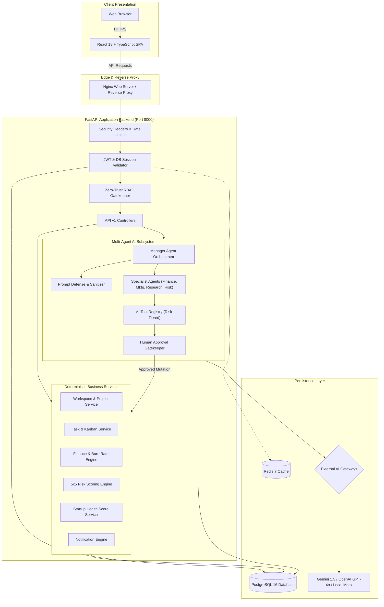

---

## 2. Frontend / Backend Architectural Layering

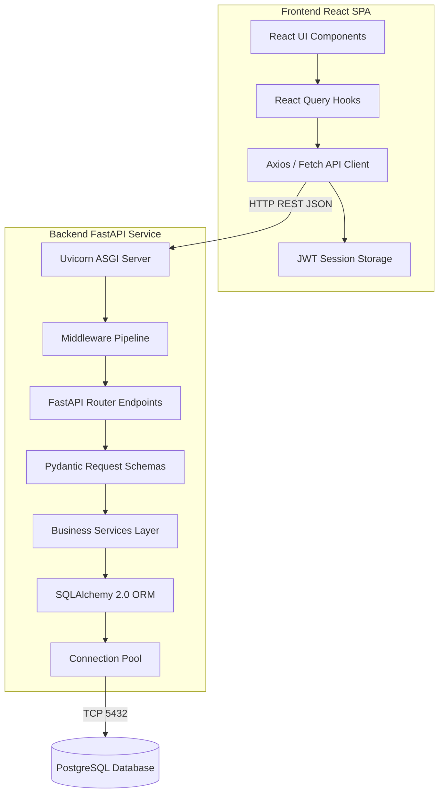

---

## 3. Database Entity Relationship (ER) Diagram

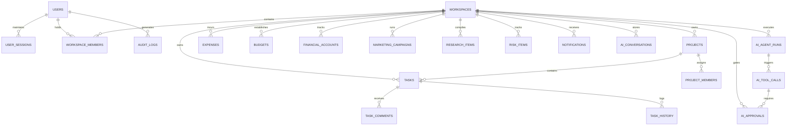

---

## 4. Authentication & Persistent Session Flow

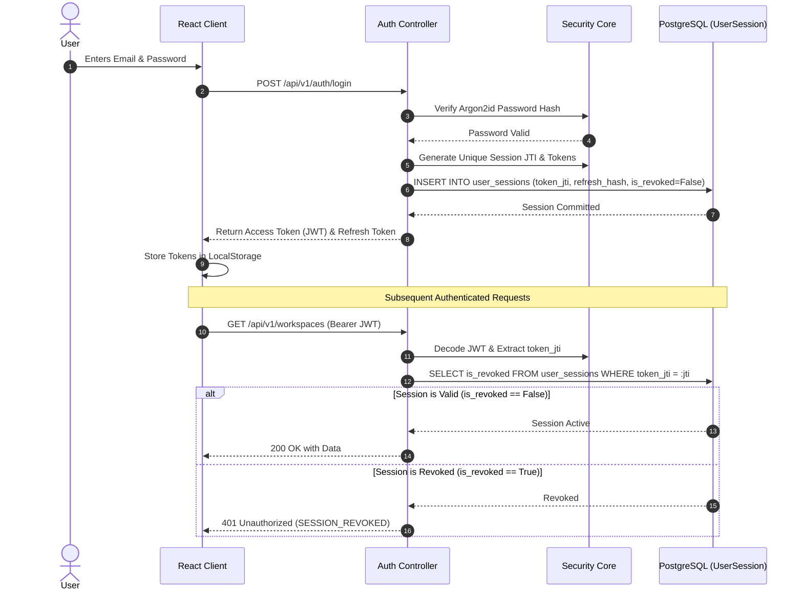

---

## 5. User Registration & Login Sequence

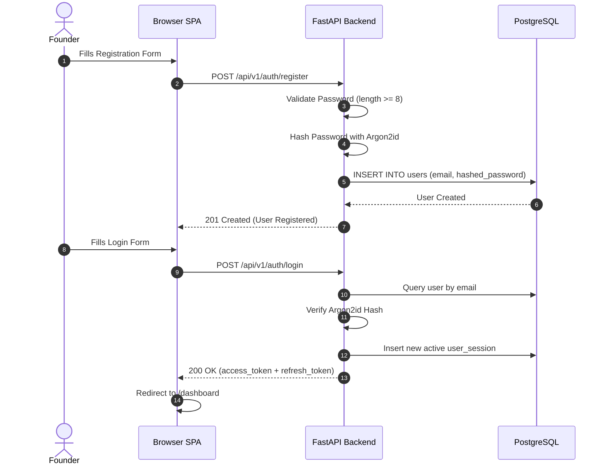

---

## 6. Manager Agent Orchestration Flow

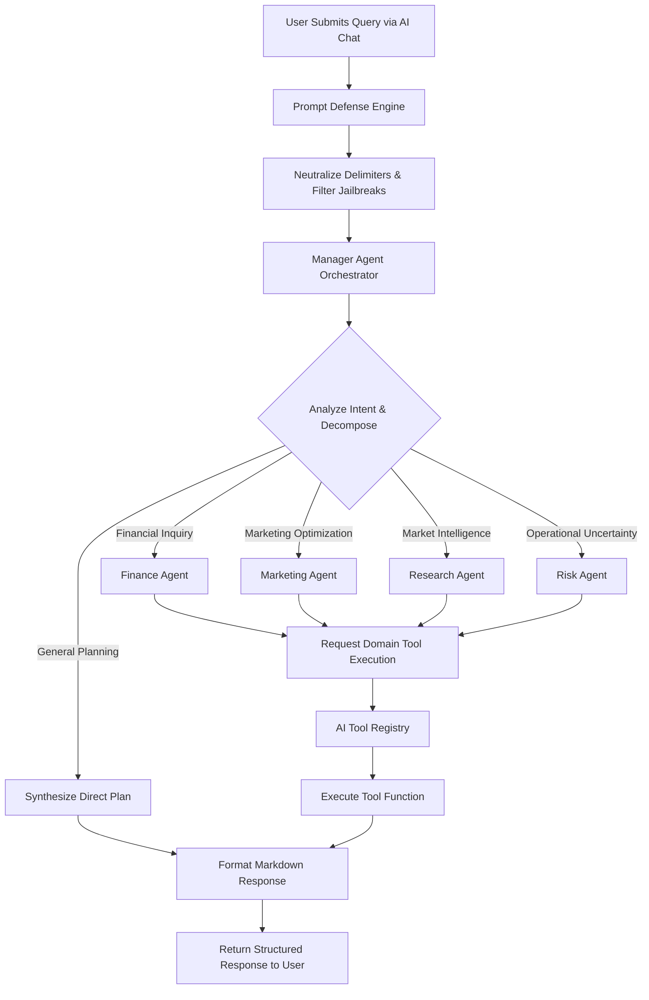

---

## 7. AI Tool Execution & Human Approval Workflow

```mermaid
flowchart TD
    AGENT["AI Agent Proposes Tool Execution"] --> REG["AI Tool Registry Lookup"]
    REG --> VAL["Validate Pydantic Schema (extra='forbid')"]
    VAL --> PERM["Check User RBAC Permissions"]
    PERM --> RISK{"Check Tool Risk Classification"}

    RISK -->|LOW Risk (Read-Only)| EXEC["Execute Tool Service Immediately"]
    EXEC --> LOG["Record AIAgentRun & AIToolCall Telemetry"]
    LOG --> RESULT["Return Tool Result to Agent"]

    RISK -->|MEDIUM / HIGH Risk (Mutations)| STAGE["Create Record in ai_approvals (status='PENDING')"]
    STAGE --> NOTIF["Dispatch Notification to Workspace Managers"]
    NOTIF --> HUMAN{"Human Manager Decision"}

    HUMAN -->|APPROVE| RUN_APP["Execute Tool Function with Approver Context"]
    RUN_APP --> AUDIT["Commit Immutable AuditLog"]
    AUDIT --> STATUS_APP["Update Approval status='APPROVED'"]

    HUMAN -->|REJECT| REJ["Record Rejection Reason in ai_approvals"]
    REJ --> STATUS_REJ["Update Approval status='REJECTED'"]
```

---

## 8. Executive Dashboard Data Aggregation Flow

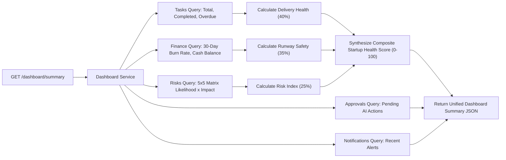

---

## 9. Notification Deduplication & Lifecycle

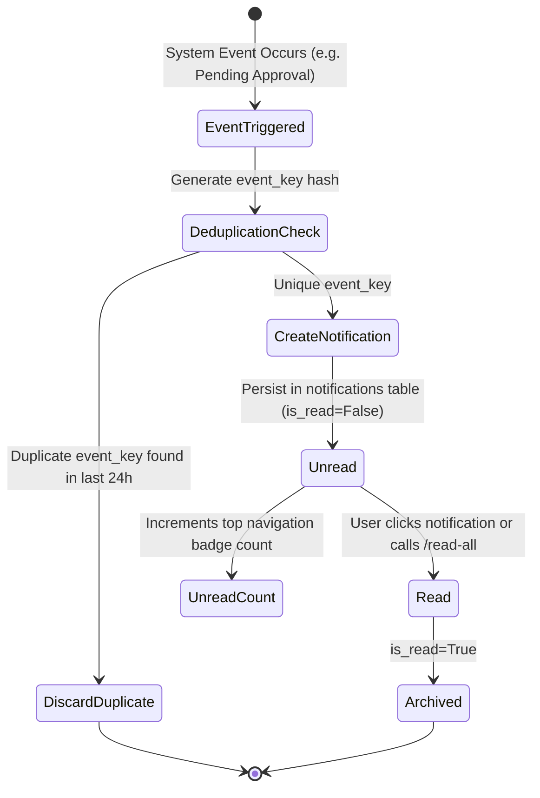

---

## 10. Container Deployment Topology

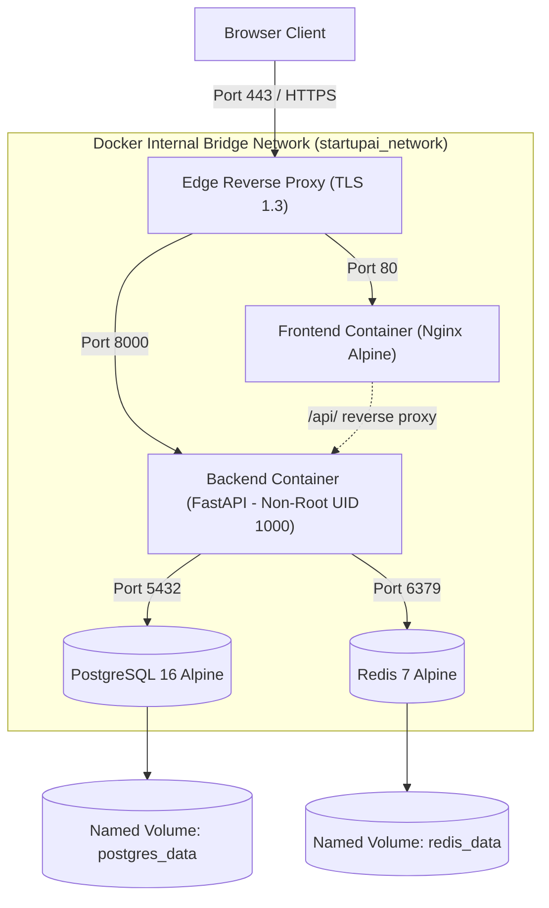

---

## 11. Database Backup & Recovery Sequence

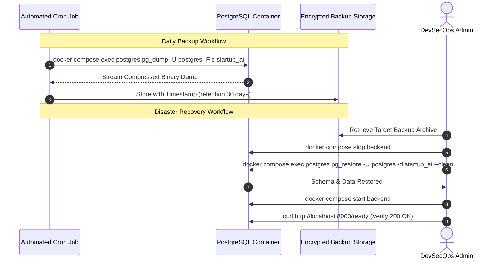

---

## 12. Complete 10-Journey End-to-End User Flow

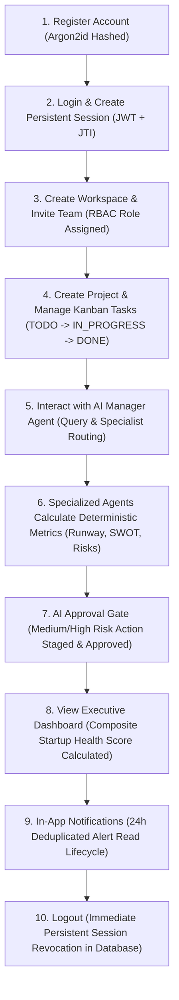
